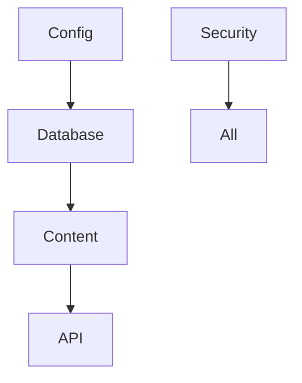

### Humanizer Project Overview

#### Core Architecture
- **Database**: PostgreSQL with pgvector
- **Security**: Encrypted credentials, role-based access
- **Configuration**: Environment-based with Pydantic schemas

#### Project Structure
```
humanizer/
├── src/humanizer/
│   ├── config/          # Configuration management
│   ├── core/            # Core functionality
│   │   ├── content/     # Content processing
│   │   ├── embedding/   # Vector operations
│   │   └── search/      # Search functionality
│   ├── db/             # Database operations
│   ├── scripts/        # Management scripts
│   └── utils/          # Utilities
```

#### Key Components

1. **Database Roles**
```
ADMIN → Full access (schema, users)
APP   → Normal operations
READ  → Query-only access
```

2. **Configuration Hierarchy**
```
Environment Variables
     ↓
.env File
     ↓
Default Config
```

3. **Security Model**
```
Encrypted Credentials → Fernet
Role-Based Access    → PostgreSQL
Config Management    → Pydantic
```

4. **Core Functions**
```python
# Database Connection
async with get_session(DatabaseRole.APP) as session:
    # Operations

# Configuration
config = load_config()  # Loads from env/files

# Content Import
importer = ConversationImporter()
await importer.import_file(path)
```

#### Change Management Symbols
```
[C] Configuration changes
[D] Database schema changes
[S] Security updates
[A] API modifications
```

#### Project Dependencies


This context represents the project after:
- Migration to PostgreSQL
- Implementation of security features
- Configuration management setup
- Project structure organization

Next steps could include:
1. Vector search implementation
2. API development
3. Content processing enhancements
4. Testing framework expansion

Would you like to focus on any particular aspect of this overview?

Give me a detailed CLI command overview and manual-level users guide for each set of commands.

# Humanizer CLI Manual

## Overview
The Humanizer CLI provides tools for managing conversations, database operations, and system configuration.

### Global Options
```bash
--verbose       # Enable detailed logging
--config PATH   # Use custom config file
```

## Database Management Commands

### Database Setup
```bash
# Initialize database
humanizer-db init [--force]
```
Options:
- `--force`: Drop and recreate all tables

### User Management
```bash
# Set up database users and permissions
humanizer-db users setup
```
Environment requirements:
```bash
POSTGRES_KEY=<fernet_key>
POSTGRES_PASSWORD_ENCRYPTED=<encrypted_password>
```

### Database Verification
```bash
# Verify database connection and permissions
humanizer-db verify
```

## Content Management Commands

### Import Commands
```bash
# Import OpenAI conversation archive
humanizer import chat PATH [OPTIONS]
```
Options:
- `--batch-size`: Number of conversations per batch (default: 100)
- `--skip-existing`: Skip existing conversations
- `--dry-run`: Show what would be imported

Example:
```bash
humanizer import chat ./chat.zip --batch-size 50
```

### Export Commands
```bash
# Export conversations
humanizer export [OPTIONS] OUTPUT_PATH
```
Options:
- `--format`: Export format (json|zip) (default: zip)
- `--filter`: Filter expression
- `--from-date`: Export from date
- `--to-date`: Export to date

Example:
```bash
humanizer export --format json --from-date 2024-01-01 ./export.json
```

## Configuration Management

### View Configuration
```bash
# Show current configuration
humanizer config show [--section SECTION]
```
Sections:
- `database`
- `vector`
- `processing`
- `storage`

### Verify Configuration
```bash
# Verify configuration
humanizer config verify
```

### Update Configuration
```bash
# Set configuration value
humanizer config set SECTION.KEY VALUE
```

Example:
```bash
humanizer config set database.host localhost
```

## Project Management

### Update Planning
```bash
# Generate update plan
humanizer project plan-updates TYPE
```
Types:
- `config`: Configuration changes
- `database`: Database schema changes
- `security`: Security updates
- `api`: API modifications

Example:
```bash
humanizer project plan-updates security
```

## Example Workflows

### Initial Setup
```bash
# 1. Set up environment
export POSTGRES_KEY="your_fernet_key"
export POSTGRES_PASSWORD_ENCRYPTED="your_encrypted_password"

# 2. Initialize database
humanizer-db init

# 3. Set up users
humanizer-db users setup

# 4. Verify setup
humanizer-db verify
```

### Import Workflow
```bash
# 1. Verify configuration
humanizer config verify

# 2. Import conversations
humanizer import chat ./chat.zip --verbose

# 3. Verify import
humanizer-db verify
```

### Export Workflow
```bash
# 1. Create export directory
mkdir exports

# 2. Export conversations
humanizer export --format zip \
    --from-date 2024-01-01 \
    --to-date 2024-12-31 \
    exports/conversations.zip
```

## Environment Variables

### Required
```bash
POSTGRES_KEY                  # Fernet key for password encryption
POSTGRES_PASSWORD_ENCRYPTED   # Encrypted database password
```

### Optional
```bash
HUMANIZER_DB_HOST            # Database host (default: localhost)
HUMANIZER_DB_PORT            # Database port (default: 5432)
HUMANIZER_DB_NAME            # Database name (default: humanizer)
HUMANIZER_LOG_LEVEL          # Logging level (default: INFO)
```

## Configuration File
Location: `~/.humanizer/config.json`
```json
{
  "database": {
    "host": "localhost",
    "port": 5432,
    "name": "humanizer"
  },
  "processing": {
    "batch_size": 100,
    "max_workers": 4
  },
  "storage": {
    "data_dir": "~/.humanizer/data",
    "temp_dir": "~/.humanizer/temp"
  }
}
```

## Error Handling

Common error codes and solutions:
```
ERROR-001: Database connection failed
  → Check database credentials and connectivity

ERROR-002: Permission denied
  → Verify user permissions are properly set up

ERROR-003: Invalid configuration
  → Check configuration file and environment variables
```

## Getting Help
```bash
# Show general help
humanizer --help

# Show command-specific help
humanizer COMMAND --help

# Show version
humanizer --version
```

Would you like me to expand on any section or add additional commands?
